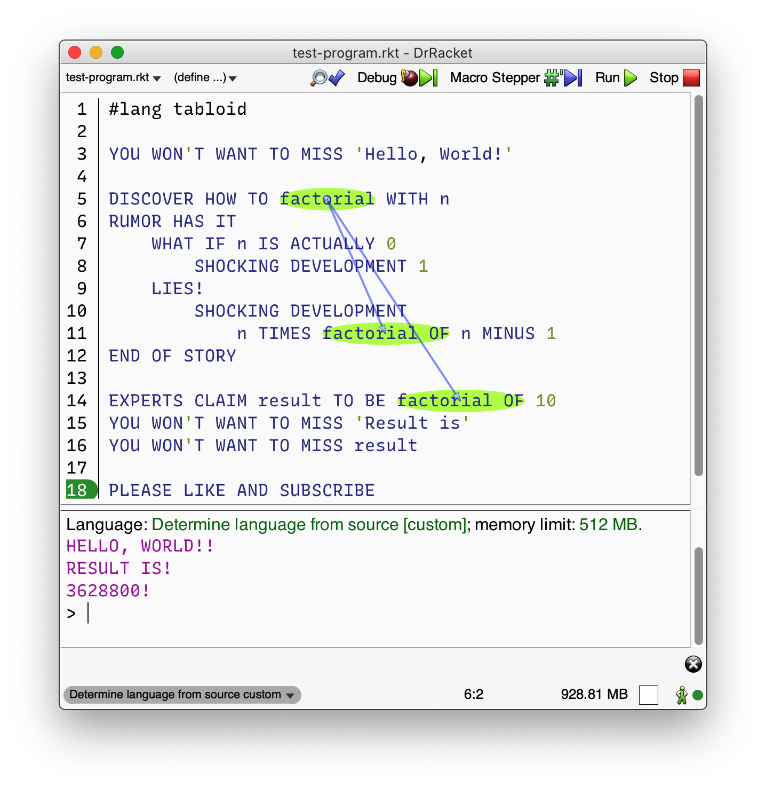

# `#lang tabloid`: Clickbait programming in Racket 

This is a quick-and-dirty Racket implementation of Linus Lee’s [Tabloid programming language][1]
(hereafter “OG Tabloid”), using the basic techniques taught in [Beautiful Racket][2]. Tabloid is
a simple language so it’s perfect for practing and demonstrating Racket’s language-oriented
programming (LOP) features. 

<figure></figure>

The [website][1] and the [README][4] were the only things I consulted. This implementation can run
the Fibonacci and factorial example programs, and generally gives the same results for any given
Tabloid code (see below), but has not been exhaustively tested. 

Any contributions and comments are of course welcome.

Thanks to Linus for this great project!

[1]: https://tabloid.vercel.app
[2]: https://beautifulracket.com
[4]: https://github.com/thesephist/tabloid/blob/master/README.md

## Use

This package is not currently available on the package server. To be able to run `#lang tabloid`
programs in your Racket installation, clone this repo and run `raco pkg install` from within the
project’s main folder.

## Under the hood

The code is pretty well commented, so crack open `main.rkt` to start a guided tour.

Every `#lang tabloid` program evaluates to `#<void>`, which is the return value of `PLEASE LIKE AND
SUBSCRIBE`

### Differences from “OG Tabloid”

I made a token effort to get most programs to produce the same results here as in OG Tabloid. For
example, performing math operations (`PLUS`, `TIMES` etc) on values that differ in type produces the
same results in both implementations.

However, there are some differences. Most of these could be considered improvements, but they mostly
result from conveniences afforded by Racket rather than from any special effort on my part.

**Operator precedence**: OG Tabloid’s parser [doesn’t know about operator precedence][3], and in
fact requires parentheses in order to use more than one infix operator in an experession. Racket
Tabloid does allow these expressions to be chained without parentheses, and will correctly
prioritize `TIMES`, `DIVIDED BY` and `MODULO` over `PLUS` and `MINUS`.

As an illustration, the program below produces a parsing error in OG Tabloid, and outputs `26!` in
this implementation:

    #lang tabloid

    YOU WON'T WANT TO MISS 7 PLUS 2 TIMES 3 MINUS 1

    PLEASE LIKE AND SUBSCRIBE

[3]: https://github.com/thesephist/tabloid#limitations

**Output:** In OG Tabloid, expressions that evaluate to a value (e.g. expressions like `10` or `1 IS
ACTUALLY 2` appearing all by themselves) do not by themselves produce any output. In Racket tabloid,
such expressions do produce output on the REPL.

**Returning from any block:** Racket Tabloid allows `SHOCKING DEVELOPMENT` to be used within any
`RUMOR HAS IT…END OF STORY` block expression. The program below produces no output in RI Tabloid,
and `A!` in Racket Tabloid:

    #lang tabloid
    
    EXPERTS CLAIM x TO BE 
      RUMOR HAS IT 
       WHAT IF (2 MODULO 2) IS ACTUALLY 0
        SHOCKING DEVELOPMENT 'A'
       LIES!
        'B'
      END OF STORY

    YOU WON'T WANT TO MISS x

    PLEASE LIKE AND SUBSCRIBE

